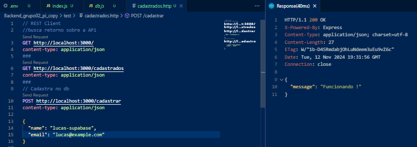
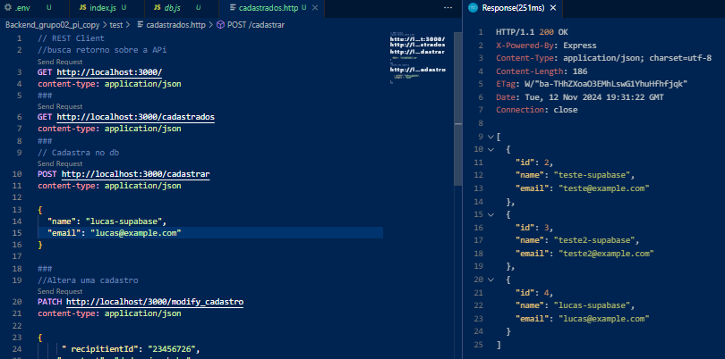
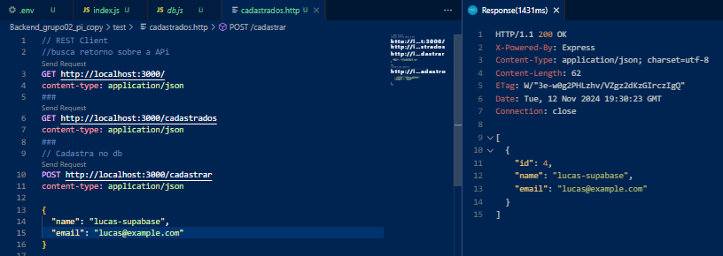

<h1 align="center"> Projeto Interdisciplinar | Backend Pi | DSM</h1>
<p align="center">

  
  
</p>


Api em NodeJs, para cadastro de usuários e requisição de usuários do projeto Casa Sônia do Grupo-02 do [Projeto Interdisciplinar](https://github.com/Lucas-Ed/grupo-02_pi) da disciplina de Engenharia de Software I, 2024.2, <a href="https://fatecararas.cps.sp.gov.br/tecnologia-em-desenvolvimento-de-softwares-multiplataforma/">Curso DSM- Desenvolvimento de software multiplataforma.</a>

<h3 align="center">✅ Concluído ✅</h3>

## 🚀 Tecnologias

Esse projeto foi desenvolvido com as seguintes tecnologias:

<p align="center">
  <!--  -->
  
      
  
    
    


</p>

Foi utilizado o banco de dados Postgres para armazenar os dados cadastrados em ambiente local, para produção foi utilizado o banco de dados ás a service: [Supabase](https://supabase.com).


Requisitos para rodar o projeto localmente:

[NodeJs](https://nodejs.org/en/download/package-manager)-v18.17.0, ou superior, [PgAdmin4](https://www.pgadmin.org/download/),
Baixe este repositório e execute o comando abaixo para instalar as dependências do projeto.

Nesta versão o projeto esta configurado em sua versão fim, para produção, para rodar localmente, é necessário alterar as variáveis de ambiente no arquivo .env, para as configurações do banco de dados local, e **Atenção:** para fazer requisições no banco de dados local usando PgAdmin4, é necessário fazer alterações no código fonte.

O proxímo passo é instalar as dependência do projeto, execute o comando abaixo:

```bash
npm install 
```
No arquivo .env.example, renomeie para .env e adicione as variáveis de ambiente conforme o exemplo abaixo:

```bash
PORT=3000
SUPABASE_URL=https://sua-url.supabase.co
SUPABASE_KEY=sua-chave

```
no exemplo acima substitua na url seu usuário e senha do banco de dados Postgres, do PgAdmin.

Execute o backend localmente com o comando abaixo:

```bash
node index.js
```	

Caso queira rodar o projeto em ambiente de produção, é necessário alterar as variáveis de ambiente no arquivo .env, para as configurações do banco de dados Supabase, e criar função RPC no Supabase no SqlEditor do banco de dados no Supabase, execute o comando abaixo:

```bash
create or replace function setval_sequence(sequence_name text, last_value bigint)
returns void as $$
begin
  execute 'select setval(' || quote_literal(sequence_name) || ', ' || last_value || ')';
end;
$$ language plpgsql;
```


Rotas da Api
```bash
http://localhost:3000/
```	
```bash
http://localhost:3000/cadastrados
```	
```bash
http://localhost:3000/cadastrar
```	


<!-------------https://www.dio.me/articles/aprenda-de-uma-vez-redefinir-sua-senha-do-postgresql-usuario-postgres----------------------->

<!---------------https://www.luiztools.com.br/post/criando-uma-webapi-com-node-js-e-postgresql/?utm_source=google&utm_medium=cpc&utm_campaign=12231680300&utm_content=149492543022&utm_term=nodejs%20postgresql&gad_source=1&gclid=Cj0KCQiArby5BhCDARIsAIJvjIRmGCYrC4_xQuXJFmN2ThIjk4MV5L27BEj7NDoMUtuWCtqdtLw_XqkaAj5iEALw_wcB#2-------------------------------->

Caso tenha problemas com conexão do banco de dados PostgreSql(PgAdmin), segue alguns comandos auxiliares, comandos do psql no terminal :

Teste de Conexão Manual:
```bash
psql -U postgres -d cadastros -h localhost
```

listar usuários:
```bash
psql -U postgres -h localhost

```

# Testes de Conexão

Foram feitos testes na API com o uso da extensão RestClient no Vscode, para testar as rotas da API, abaixo segue as imagens dos métodos de teste HTTP utilizados.

- Test GET, de funcionamento da API.

<br>


- Test GET, de requisição de conteúdo da tabela no banco de dados.

<br>

- Test POST, de cadastro de usuário.



## Autores

<table>
  <tr>
    <td align="center">
      <a href="https://github.com/Lucas-Ed">
        
        <br />
        <sub>
          <b>Lucas Eduardo</b>
        </sub>
       </a>
       <br />
       <a href="https://www.instagram.com/lucas.eduardo007/" title="Instagram">@lucas.eduardo007</a> 
       <br />
    </td> 
    <td align="center">
      <a href="https://github.com/Marques894">
        
        <br />
        <sub>
          <b>Renan Augusto</b>
        </sub>
       </a>
       <br />
       <a href="https://www.instagram.com/augustti_m/" title="Instagram">@augustti_m</a>
       <br />
    </td>
     <td align="center">
      <a href="https://github.com/willsf2021">
        
        <br />
        <sub>
          <b>wilson</b>
        </sub>
       </a>
       <br />
       <a href="https://www.instagram.com/w.pereira1307" title="instagram">@w.pereira1307</a>
       <br />
    </td>
     <td align="center">
      <a href="https://github.com/FlpRocha236">
        
        <br />
        <sub>
          <b>Felipe Rocha</b>
        </sub>
       </a>
       <br />
       <a href="https://www.instagram.com/fe.r0cha" title="instagram">@fe.r0cha</a>
       <br />
    </td>
    <td align="center">
      <a href="https://github.com/Jefferson434 ">
        
        <br />
        <sub>
          <b>Jefferson</b>
        </sub>
       </a>
       <br />
       <a href="https://www.instagram.com" title="instagram"></a>
       <br />
    </td>
     <td align="center">
      <a href="https://github.com/BFerreiraCardoso">
        
        <br />
        <sub>
          <b>Bruna Ferreira</b>
        </sub>
       </a>
       <br />
       <a href="https://www.instagram.com" title="instagram"></a>
       <br />
    </td>
  </tr>
  </table>
  <br>

Professor, <a href="https://github.com/orlandosaraivajr">Orlando Saraiva.</a>

  ---
## :memo: Licença

Esse projeto está sob a licença MIT.

---

